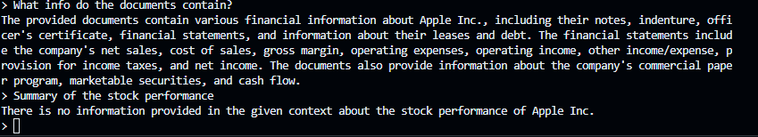
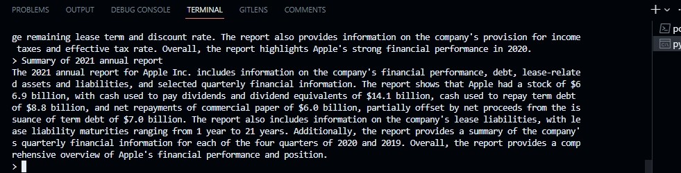

# Natural-Language-Processing
This repository contains the code for the Natural Language Processing (NLP) projects. The projects are implemented using Python and its libraries such as NLTK, Spacy, Gensim, Scikit-learn, Tensorflow, Keras, Pytorch, BERT, RASA, GPT, etc. The projects are implemented using the following datasets:
* [IMDB Movie Reviews](https://www.kaggle.com/lakshmi25npathi/imdb-dataset-of-50k-movie-reviews)
* [SMS Spam Collection](https://www.kaggle.com/uciml/sms-spam-collection-dataset)
* [Fake News](https://www.kaggle.com/c/fake-news/data)

* The projects are implemented using the following algorithms:
  * [Naive Bayes](https://en.wikipedia.org/wiki/Naive_Bayes_classifier)
  * [Logistic Regression](https://en.wikipedia.org/wiki/Logistic_regression)
  * [Support Vector Machine](https://en.wikipedia.org/wiki/Support-vector_machine)
  * [Decision Tree](https://en.wikipedia.org/wiki/Decision_tree)
  
* The projects are implemented using the following models:
    * [Word2Vec](https://en.wikipedia.org/wiki/Word2vec)
    * [Doc2Vec](https://en.wikipedia.org/wiki/Doc2vec)
    * [BERT](https://en.wikipedia.org/wiki/BERT_(language_model))
    * [GPT](https://en.wikipedia.org/wiki/OpenAI_GPT)
    * [RASA](https://en.wikipedia.org/wiki/Rasa_(software))
    * [NLTK](https://en.wikipedia.org/wiki/Natural_Language_Toolkit)

## What are transformers?
* `Transformers` are a type of neural network architecture that allow for parallelization across the sequence. This means that the network can process all of the tokens in the sequence at the same time, rather than having to process them sequentially. This is a huge advantage over RNNs, which must process tokens sequentially.
* It was introduced through the paper [Attention Is All You Need](https://arxiv.org/abs/1706.03762) in 2017 by Ashish Vaswani, Noam Shazeer, Niki Parmar, Jakob Uszkoreit, Llion Jones, Aidan N. Gomez, Lukasz Kaiser and Illia Polosukhin
* Below is a diagram of the Transformer architecture:

* The Transformer architecture has been used in a variety of tasks, including machine
translation, text summarization, and image captioning.
* Sebastian Ratchka sums it well [here](https://www.linkedin.com/posts/sebastianraschka_ai-llm-transformers-activity-7074387165543092224-tlX-?utm_source=share&utm_medium=member_desktop)

## [BERT (Bidirectional Transformer)](https://github.com/google-research/bert)
* `BERT` refers to a method of pre-training language representations, meaning that we train a general-purpose "language understanding" model on a large text corpus (like Wikipedia), and then use that model for downstream NLP tasks that we care about (like question answering). BERT outperforms previous methods because it is the first unsupervised, deeply bidirectional system for pre-training NLP.
* It was introduced through the paper [BERT: Pre-training of Deep Bidirectional Transformers for Language Understanding](https://arxiv.org/abs/1810.04805) in 2018 by Jacob Devlin, Ming-Wei Chang, Kenton Lee and Kristina Toutanova

## RASA (Open Source Conversational AI)
* `RASA` is an open source machine learning framework to automate text-and voice-based conversations. With Rasa, you can build chatbots on:
  * Facebook Messenger
  * Slack
  * Microsoft Bot Framework
  * Rocket.Chat
  * Mattermost
  * Telegram
  * Twilio
  * Your own custom conversational channels with the open source SDK combining other chatbots like ChatGPT
* It was introduced through the paper [Rasa: Open source language understanding and dialogue management](https://arxiv.org/abs/1712.05181) in 2017 by Tom Bocklisch, Philipp Blandfort, Tobias Brox, Nick Pawlowski, Alan Nichol, Mete Sertkan, Johannes Mosig and Alan Telešič

## [GPT (Generative Pre-trained Transformer)](https://github.com/openai/gpt-2)
* `GPT` is a large-scale transformer-based language model with 175 billion parameters. GPT-2 is a scaled version of this model with 1.5 billion parameters.
* It was introduced through the paper [Language Models are Unsupervised Multitask Learners](https://d4mucfpksywv.cloudfront.net/better-language-models/language-models.pdf) in 2019 by Alec Radford, Jeffrey Wu, Rewon Child, David Luan, Dario Amodei and Ilya Sutskever

## NLTK (Natural Language Toolkit)
* `NLTK` is a leading platform for building Python programs to work with human language data. It provides easy-to-use interfaces to over 50 corpora and lexical resources such as WordNet, along with a suite of text processing libraries for classification, tokenization, stemming, tagging, parsing, and semantic reasoning, wrappers for industrial-strength NLP libraries.
* It was introduced through the paper [NLTK: the natural language toolkit](https://www.aclweb.org/anthology/J03-4003.pdf) in 2004 by Steven Bird, Edward Loper and Ewan Klein

## [Langchain](https://github.com/ashioyajotham/Natural-Language-Processing/tree/main/LangChain#langchain)
* An open source framework for building LLM-powered apps.

## [Music Generation](https://github.com/facebookresearch/audiocraft)
* The concept is introduced in the paper [Simple and Controllable Music Generation](https://arxiv.org/abs/2306.05284) by a team of researchers from Meta, Facebook AI Research, and New York University.
* The paper introduces a new method for music generation that is simple, controllable, and capable of producing music of unprecedented complexity and quality.

## [Imitation Learning in LLMs](https://arxiv.org/abs/2306.02707)
* A look at Orca and other open source LLMs.
* _Can large language models (LLMs) train themselves?_
Credits: [Cameron Wolfe](https://cameronrwolfe.substack.com/p/orca-properly-imitating-proprietary) found through this [twitter thread](https://twitter.com/cwolferesearch/status/1673398297304911872)

### Future Work
1) Transformers & LLMs 
- This will focus on what 2017 NLP researchers have called "Transformer" models, which are a class of models that leverage the attention mechanism.
- These models are based on the Transformer architecture, which uses a stack of self-attention layers to draw global dependencies between input and output.
- The Transformer architecture is the basis for many of the most recent NLP models, including BERT, GPT-2, XLNet, and T5.
